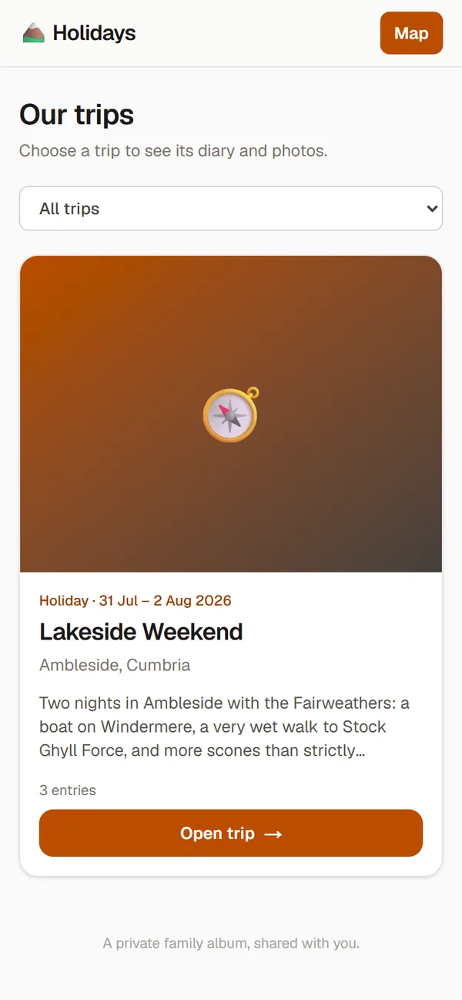
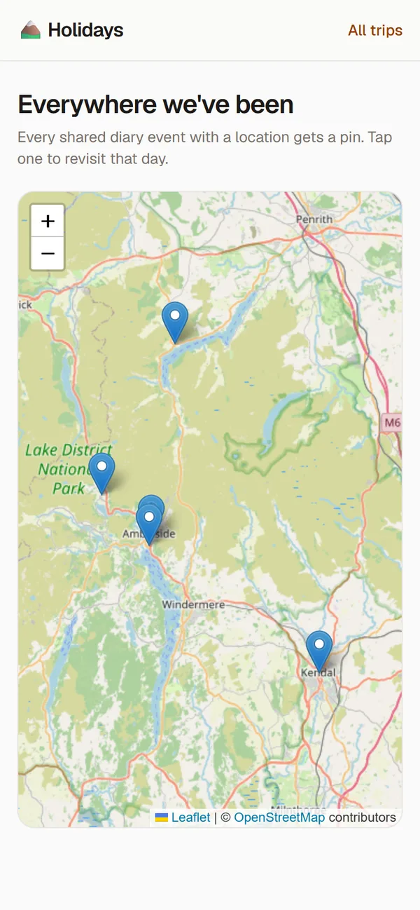

# Awaydays

A private, mobile-first diary of your family's holidays, day trips and
days out. Everyone adds entries and photos from their phones while you're
away; the app draws the journey on a map, and you can share a read-only
copy with the grandparents through a link you can revoke any time.

It started as one family's app and still is — it's just open now, so
yours can have one too.

<p align="center">
  
  
  
  
</p>

<p align="center"><sub>Demo data — a fictional weekend in the Lake District, as a relative sees it through a share link. Maps shown in the Leaflet fallback; with a Google Maps key they render in Google's style.</sub></p>

## What it does

- **Diary** — trips containing dated entries, with Markdown, soft delete and
  an admin recycle bin that restores or permanently deletes.
- **Photos and video** — resumable uploads straight from a phone, galleries
  with a full-screen pinch-to-zoom viewer, captions, reordering, cover
  photos. Video with poster frames and web-sized copies.
- **Maps and journeys** — every entry with a place gets a pin; consecutive
  stops become journey legs decorated by how you travelled, with car and
  bus legs following real roads. Journeys start from home.
- **Sharing** — revocable, optionally expiring links for one trip or the
  whole diary, each named after whoever holds it so you can see who's been
  looking. Visitors only ever see web-sized photos.
- **Planning** — future trips carry an itinerary (bookings, times, costs,
  PDF confirmations) and a list of ideas. Optionally, an AI research search
  that finds places near your hotel, and Tripadvisor ratings on the things
  you save.
- **The small things** — emoji reactions, trip type and year filters,
  installs to a phone home screen as a PWA, UK English throughout.

## The stack, and what's optional

This is an opinionated app. It does one thing well on one stack, and it
doesn't try to be configurable beyond that.

| | |
|---|---|
| **Required** | [Supabase](https://supabase.com) — auth, Postgres with row-level security, private storage. The free tier is plenty for a family. Supabase is open source, so you can self-host it instead if you prefer. |
| **Hosting** | Anywhere Next.js runs. [Vercel](https://vercel.com) is the documented path (Hobby tier, for personal use). |
| **Maps** | Google Maps if you give it a key, otherwise Leaflet. Works either way. |
| **Optional extras** | A [Vercel AI Gateway](https://vercel.com/ai-gateway) key for the research search; a [Tripadvisor](https://docs.terra.tripadvisor.com/) key for ratings; an ArcGIS key for English-labelled fallback tiles. Each feature simply doesn't appear without its key. |

Running cost for a typical family on free tiers: nothing. The setup guide
names the caveats (free Supabase projects pause when idle; storage quotas;
Google's free map loads and how to cap them so you can never be billed).

## Install with your coding agent

The whole thing is documented for agents. Clone it, open it in Claude
Code, Codex, Cursor or whatever you use, and say:

> Follow SETUP.md and get this running for me.

The agent does the mechanical parts. You do the parts only a human should:
create the Supabase and Vercel accounts, generate the keys, and paste them
into `frontend/.env.local` yourself. `SETUP.md` marks those steps clearly.

Prefer to drive? The same file is a perfectly good manual guide.

## Want a different stack? Fork it

Supabase is load-bearing; hosting is not. If you want Cloudflare, Firebase,
plain Postgres or anything else, the honest route is a fork, and
[`docs/porting.md`](docs/porting.md) maps exactly what touches what so your
agent can do the port with its eyes open. The main repo stays single-stack
on purpose.

## Changing it

[`AGENTS.md`](AGENTS.md) is the entry point for working on the code, and
the `docs/` folder is organised by subsystem. The check suite, from
`frontend/`:

```bash
npx tsc --noEmit && npm run lint && npm run test && npm run build
```

## Maintenance, honestly

This is a family app first. Improvements land in the family's private copy
and are synced here periodically. Issues are welcome — bug reports
especially, and feature ideas too. Pull requests are reviewed when they
arrive; see [`CONTRIBUTING.md`](CONTRIBUTING.md) for what to expect.

## Licence and security

MIT — see [`LICENSE`](LICENSE). To report a security problem privately,
see [`SECURITY.md`](SECURITY.md).
